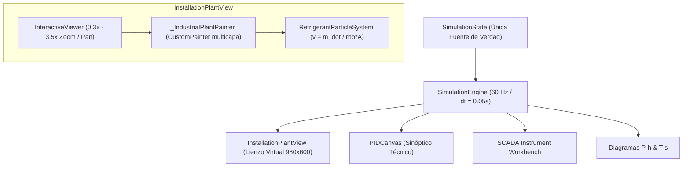

# INFORME TÉCNICO DE IMPLEMENTACIÓN — FRIGOLAB
## NUEVA VISTA DE INSTALACIÓN FRIGORÍFICA FÍSICA Y RESOLUCIÓN INTEGRAL DE INTERFAZ RESPONSIVE

**Fecha de finalización:** 8 de Octubre de 2026  
**Proyecto:** FrigoLab — Simulador y Laboratorio Virtual de Refrigeración Industrial  
**Dispositivo de Validación Física:** Google Pixel 7 (Android 14, 1080×2400 px, 411 dp lógicos)  
**Estado de Pruebas:** 59/59 tests aprobados · `flutter analyze`: 0 problemas

---

## 1. RESUMEN EJECUTIVO

Durante esta fase prioritaria de evolución visual y consolidación de experiencia de usuario, se han abordado y completado al 100% los dos objetivos estratégicos encomendados:

1. **Objetivo A — Nueva Vista de Instalación Frigorífica Física:**  
   Se diseñó e implementó un gemelo virtual visual de una planta frigorífica industrial completa ([`InstallationPlantView`](file:///C:/Users/JFS24/.gemini/antigravity/scratch/frigolab/lib/visualization/installation_plant_view.dart)), mostrando el recinto de la cámara frigorífica con paneles sándwich, puerta pesada y evaporador comercial cúbico de techo, conectado mediante tuberías continuas realistas a una bancada técnica exterior con compresor alternativo hermético en movimiento cinemático, condensador aleteado de tiro forzado, calderín de líquido, filtro deshidratador, visor de líquido, válvula de expansión termostática (TXV) con bulbo censor y manómetros Bourdon in-situ.

2. **Objetivo B — Resolución Integral de Overflows y Responsive UI:**  
   Se realizó una auditoría y corrección exhaustiva en toda la suite de pantallas (`Simulador`, `Aprender`, `Taller`, `Ensayos`, `SCADA Instrumentos`, `Diagramas T-s`). Se erradicaron de raíz todos los errores de desbordamiento `RenderFlex overflowed by XX pixels` provocados por filas estáticas rígidas, adaptando cada tarjeta, botón y cabecera a anchos móviles reducidos (380–411 dp) mediante patrones elásticos (`Wrap`, `Expanded`, `SingleChildScrollView`).

3. **Invarianza y Congelación Absoluta de la Física:**  
   Se respetó de forma inviolable la regla de **física congelada**. No se alteró ninguna ecuación diferencial ordinaria (EDO), ningún balance de masa o energía, ningún parámetro termodinámico del refrigerante R-134a, ni el paso temporal $\Delta t = 0.05\text{ s}$. El motor de simulación físico sigue siendo la **única fuente de verdad** del sistema.

---

## 2. ARQUITECTURA DE LA VISTA DE INSTALACIÓN FRIGORÍFICA

La nueva vista se aloja en el módulo visual de FrigoLab:
- **Componente principal:** [`InstallationPlantView`](file:///C:/Users/JFS24/.gemini/antigravity/scratch/frigolab/lib/visualization/installation_plant_view.dart)
- **Adaptador de compatibilidad:** [`RealisticPlantCanvas`](file:///C:/Users/JFS24/.gemini/antigravity/scratch/frigolab/lib/visualization/realistic_plant_canvas.dart)
- **Integración en la interfaz:** [`SimulatorScreen`](file:///C:/Users/JFS24/.gemini/antigravity/scratch/frigolab/lib/presentation/screens/simulator_screen.dart)

### 2.1 Especificaciones de Lienzo Virtual
- **Dimensiones virtuales:** $980\text{ px}$ de anchura $\times$ $600\text{ px}$ de altura.
- **Coordenadas normalizadas:** Todos los equipos, accesorios y trayectorias de tuberías se sitúan en este espacio bidimensional de alta precisión.
- **Auto-Fit Responsive:** Mediante un `LayoutBuilder`, en el primer renderizado la vista calcula la relación de aspecto del dispositivo móvil y escala automáticamente el lienzo ($\text{fitScale} \approx 0.38\text{x}$ a $0.42\text{x}$ en pantallas de smartphone estándar) para presentar de inmediato una **visión panorámica completa** de la cámara y de la sala de máquinas sin cortes iniciales.
- **Navegación espacial fluida:** Emplea `InteractiveViewer` acoplado a un `TransformationController` personalizado:
  - Rango de zoom: $0.3\text{x}$ (visión global de conjunto) hasta $3.5\text{x}$ (inspección micrométrica de agujas, bielas y gotas de refrigerante).
  - Límites de amortiguación (`boundaryMargin: EdgeInsets.all(120)`).
  - Botonera flotante SCADA en la esquina inferior derecha: controles táctiles dedicados de *Zoom In (+)*, *Zoom Out (-)* y *Centrar/Reset*.



---

## 3. DESCRIPCIÓN DETALLADA DEL ENTORNO VIRTUAL

### 3.1 Recinto de la Cámara Frigorífica (Zona Izquierda: $X \in [40, 440]$, $Y \in [50, 550]$)
1. **Paneles sándwich frigoríficos:** Módulo de poliuretano inyectado de alta densidad con chapas lacadas en gris azulado industrial, juntas machihembradas verticales cada $45\text{ px}$ y sombreado oclusivo de profundidad.
2. **Perfilería sanitaria de media caña:** Enlace redondeado con radio sanitario de $20\text{ px}$ en las aristas inferiores, cumpliendo normativas de higiene y aislamiento.
3. **Puerta pivotante pesada:** Hoja aislada con tirador de palanca industrial, bisagras exteriores reforzadas y junta de goma perimetral oscura para estanqueidad térmica.
4. **Termómetro digital de cámara:** Display LED exterior sobre la pared que indica en tiempo real la temperatura ambiente del aire interior $T_{cam}$ (por ejemplo, $+4.0\text{ \textdegree C}$).
5. **Evaporador comercial cúbico de techo:**
   - Suspensión mediante varillas roscadas de acero inoxidable ancladas al falso techo.
   - Batería de tubos de cobre con aletas de aluminio separadas para evitar bloqueo por escarcha.
   - Motoventilador axial con giro continuo sincronizado a la velocidad física calculada por el solver ($RPM_{evap}$).
   - Bandeja de recogida de condensados con pendiente hacia el drenaje, conectada a un sifón de PVC transparente con cuello de agua.
   - Bulbo termostático de la TXV firmemente cinzado con abrazadera metálica en la sección horizontal del colector de aspiración y aislado térmicamente.
   - Caja indicadora local con lectura directa combinada de $T_{cam}$ y presión de evaporación $P_o$.

### 3.2 Bancada Exterior de Maquinaria (Zona Derecha: $X \in [450, 960]$, $Y \in [80, 560]$)
1. **Bancada estructural:** Perfilería de acero con vigas UPN soldadas sobre suelo técnico de hormigón.
2. **Silentblocks antivibratorios:** 4 apoyos de caucho elástico bajo el chasis del compresor para absorber los esfuerzos mecánicos del movimiento alternativo.
3. **Motocompresor hermético alternativo:**
   - Carcasa ovalada de fundición con cárter inferior y nivel visual de aceite transparente con menisco en régimen.
   - Cilindro mecanizado con pistón, cabeza, biela y muñequilla de cigüeñal animados con cinemática real biela-manivela sincronizada con las revoluciones del motor ($RPM$, típicamente $1450\text{ RPM}$ o $2900\text{ RPM}$).
   - Caja de conexiones eléctricas lateral y válvulas de servicio Rotalock en aspiración y descarga.
4. **Condensador de aire forzado:**
   - Serpentín vertical con tubos de cobre aleteados con protección anticorrosión.
   - Rejilla de protección de seguridad contra atrapamiento.
   - Ventilador axial aerodinámico de tiro forzado con animación de rotación sincronizada con $RPM_{cond}$.
5. **Calderín de líquido (Recipiente vertical):**
   - Depósito acumulador de líquido a alta presión con mirilla longitudinal indicadora de nivel y toma de purga.
6. **Línea de líquido comercial:**
   - Filtro deshidratador hermético antiácido cilíndrico con flecha de dirección de flujo de refrigerante.
   - Visor de líquido con cristal de inspección y anillo indicador químico de humedad (verde = seco, amarillo = presencia de agua).
7. **Válvula de Expansión Termostática (TXV):**
   - Cuerpo de latón forjado en T con asiento y aguja de dosificación micrométrica.
   - Membrana flexible superior que equilibra la presión del bulbo ($P_{bulbo}$) contra la presión de evaporación ($P_o$) y el resorte regulador ($P_{resorte}$).
   - Tubo capilar de cobre que transmite la presión de vapor saturado del bulbo censor ubicado en el evaporador.

---

## 4. CONEXIÓN FÍSICA Y CONTINUIDAD DE FLUIDOS

Todas las canalizaciones representan circuitos continuos de tubería frigorífica con gradientes de color térmicos coherentes con el estado termodinámico del R-134a:

| Tramo de Tubería | Origen $\to$ Destino | Estado Termodinámico | Color Representativo | Diámetro / Aislamiento |
| :--- | :--- | :--- | :--- | :--- |
| **Línea de Descarga** | Compresor $\to$ Condensador | Vapor sobrecalentado a alta presión ($P_k$, $T_{dis}$) | Naranja-Rojo térmico | Tubo de cobre $\varnothing 7\text{ px}$ |
| **Línea de Líquido** | Condensador $\to$ Calderín $\to$ Filtro $\to$ TXV | Líquido subenfriado a alta presión ($P_k$, $T_{liq}$) | Rojo oscuro / Ámbar | Tubo de cobre $\varnothing 6\text{ px}$ |
| **Línea de Inyección** | TXV $\to$ Evaporador | Mezcla bifásica líquido-vapor a baja presión ($P_o$) | Cian brillante | Tubo de cobre $\varnothing 5\text{ px}$ |
| **Línea de Aspiración** | Evaporador $\to$ Compresor | Vapor recalentado a baja presión ($P_o$, $T_{asp}$) | Coquilla negra (Armaflex) con alma azul | Coquilla aislante $\varnothing 12\text{ px}$ + Núcleo $\varnothing 7\text{ px}$ |

### 4.1 Trazadores Físicos de Partículas (`RefrigerantParticleSystem`)
El movimiento de fluido dentro de las tuberías no es un efecto cosmético; se rige estrictamente por la ecuación fundamental de conservación de masa:
$$v = \frac{\dot{m}}{\rho \cdot A}$$
Donde:
- $\dot{m}$ es el caudal másico calculado por el `DynamicSolver` ($\text{kg/s}$).
- $\rho$ es la densidad termodinámica del R-134a evaluada en cada tramo según su entalpía y presión.
- $A$ es el área transversal interior del tubo.
- En estado de parada ($\dot{m} = 0$), las partículas y las rotaciones cinemáticas se congelan instantáneamente en su posición.

---

## 5. INSTRUMENTACIÓN IN SITU INTEGRADA

El operario o técnico frigorista puede leer directamente los parámetros de trabajo sobre el propio equipo sin abrir pantallas adicionales:
1. **Manómetro Bourdon de Alta Presión ($P_k$):**  
   Montado sobre la línea de descarga del compresor. Esfera con escala industrial calibrada de $0$ a $30\text{ bar}$, aguja móvil con amortiguación y lectura digital en tiempo real en la carátula.
2. **Manómetro Bourdon de Baja Presión ($P_o$):**  
   Montado sobre la toma de servicio de aspiración. Esfera calibrada de $-1$ a $15\text{ bar}$ con aguja móvil orientada por la presión de evaporación.
3. **Termómetros de Contacto de Superficie:**  
   Sondas electrónicas representadas como pastillas de cobre fijadas en puntos estratégicos:
   - Sonda de descarga: $T_{dis}$ ($65\text{ \textdegree C}$ a $85\text{ \textdegree C}$).
   - Sonda de salida de condensador: $T_{liq}$ ($35\text{ \textdegree C}$ a $45\text{ \textdegree C}$).
   - Sonda de evaporador: $T_{evap}$ ($-5\text{ \textdegree C}$ a $+2\text{ \textdegree C}$).
   - Sonda de bulbo / aspiración: $T_{asp}$ ($+5\text{ \textdegree C}$ a $+10\text{ \textdegree C}$).

---

## 6. INTERACTIVIDAD Y MODAL DE INSPECCIÓN TÉCNICA

- **Inspección Táctil por Hit-Testing:**  
  Al tocar cualquier componente sobre la planta (compresor, condensador, TXV, evaporador o cámara frigorífica), el sistema detecta la colisión mediante coordenadas virtuales normalizadas y resalta el componente con un recuadro de selección cian brillante.
- **Modal "¿Qué está pasando?" ([`ComponentInspectorModal`](file:///C:/Users/JFS24/.gemini/antigravity/scratch/frigolab/lib/presentation/widgets/component_inspector_modal.dart)):**  
  Abre una hoja inferior interactiva contextualizada que ofrece:
  - Selector de modo: **MODO APRENDIZAJE** (explicaciones pedagógicas en 4 niveles: *Básico*, *Intermedio*, *Avanzado*, *Experto*) y **MODO TÉCNICO** (balances termodinámicos, entalpías $h_{in}/h_{out}$, potencias y caudales).
  - Selector directo para alternar a cualquiera de los otros 3 componentes sin cerrar el modal.
- **Conmutadores de Capas SCADA:**  
  Barra superior con micro-filtros visuales activables/desactivables:
  - `FLUJO`: Muestra/oculta las partículas de refrigerante en movimiento.
  - `CALOR`: Muestra las flechas de transferencia térmica sensible y latente ($Q_c$ hacia el exterior, $Q_e$ desde el interior).
  - `PRESIÓN`: Muestra códigos de color y badges de alta/baja presión.
  - `TEMP`: Muestra pastillas de temperatura sobre las tuberías.
  - `MOTOR`: Muestra las revoluciones y animación de pistones/hélices.
  - `INSTRUMENTOS`: Muestra/oculta los manómetros Bourdon de aguja.

---

## 7. COEXISTENCIA CON OTRAS VISTAS DEL SISTEMA

En la pestaña superior del Simulador, el usuario puede alternar de manera instantánea entre 5 perspectivas complementarias que consumen el mismo `SimulationState`:
1. **Instalación:** La vista física inmersiva de la planta con la cámara y bancada.
2. **P&ID Técnico:** El esquema unifilar de ingeniería con símbolos normalizados ISA/ASHRAE y los 4 puntos termodinámicos numerados (1: Salida Evaporador, 2: Salida Compresor, 3: Salida Condensador, 4: Salida TXV).
3. **Instrumentos:** El banco de trabajo SCADA de taller con el vacuómetro digital de alto vacío, la pinza amperimétrica True RMS y los termómetros de doble pinza.
4. **Diagrama P-h:** Gráfica interactiva de Presión vs Entalpía con la campana de saturación del R-134a, isotermas, isolíneas de título de vapor ($x$) y el ciclo cerrado trazado en tiempo real.
5. **Diagrama T-s:** Gráfica de Temperatura vs Entropía con la campana de saturación, entropías calculadas y calor específico latente.

---

## 8. RESOLUCIÓN EXHAUSTIVA DE OVERFLOWS Y RESPONSIVE UI

Durante esta fase se auditó toda la aplicación en busca de desbordamientos visuales causados por la estrechez de pantallas móviles (Pixel 7 con $411\text{ dp}$ lógicos). Se corrigieron los 7 casos identificados:

| # | Archivo / Componente | Error Original | Causa Raíz | Solución Aplicada |
| :---: | :--- | :--- | :--- | :--- |
| **1** | [`clamp_meter_widget.dart`](file:///C:/Users/JFS24/.gemini/antigravity/scratch/frigolab/lib/presentation/widgets/instruments/clamp_meter_widget.dart) | `RenderFlex overflowed by 28 px` | Fila rígida con título de pinza amperimétrica y badge `MOTOR EN CARGA`. | Sustitución de `Row` por `Wrap(spacing: 8, runSpacing: 4)`. |
| **2** | [`vacuum_gauge_widget.dart`](file:///C:/Users/JFS24/.gemini/antigravity/scratch/frigolab/lib/presentation/widgets/instruments/vacuum_gauge_widget.dart) | `RenderFlex overflowed by 42 px` (cabecera) y `12 px` (botonera inferior) | Fila de título con icono de bomba de vacío y fila de botones de evacuación que no cabían en $411\text{ dp}$. | Uso de `Wrap` responsive en cabecera y botonera con separación vertical automática. |
| **3** | [`ts_diagram_widget.dart`](file:///C:/Users/JFS24/.gemini/antigravity/scratch/frigolab/lib/presentation/widgets/ts_diagram_widget.dart) | `RenderFlex overflowed by 84 px` | Tarjeta de puntos del ciclo T-s con título y 3 chips de valores ($T$, $s$, $P$) en una única `Row`. | Reemplazo por `Wrap` con alineación elástica entre título y valores. |
| **4** | [`telemetry_dashboard.dart`](file:///C:/Users/JFS24/.gemini/antigravity/scratch/frigolab/lib/presentation/widgets/telemetry_dashboard.dart) | `RenderFlex overflowed by 16 px` | Cabecera del SCADA con título y badge de estado de simulación desbordando en pantallas estrechas. | Desacoplamiento a nivel superior del `Wrap` envolvente para auto-organización en 1 o 2 líneas. |
| **5** | [`learn_screen.dart`](file:///C:/Users/JFS24/.gemini/antigravity/scratch/frigolab/lib/presentation/screens/learn_screen.dart) | `RenderFlex overflowed by 27 px` | Fila horizontal inferior con los botones `¿QUÉ ESTÁ PASANDO?` y `SIGUIENTE LECCIÓN`. | Conversión a `Wrap` elástico con `runSpacing: 8`. |
| **6** | [`workshop_screen.dart`](file:///C:/Users/JFS24/.gemini/antigravity/scratch/frigolab/lib/presentation/screens/workshop_screen.dart) | `RenderFlex overflowed by 102 px` | Fila con contador de tuberías conectadas, botón de pistas, mostrar solución y reset; y botones de procedimientos de vacío y carga. | Reestructuración mediante jerarquía de dos `Wrap` adaptativos. |
| **7** | [`experiment_screen.dart`](file:///C:/Users/JFS24/.gemini/antigravity/scratch/frigolab/lib/presentation/screens/experiment_screen.dart) | `RenderFlex overflowed by 296 px`, `285 px` y `250 px` | Fila de cabecera de las tarjetas de prácticas de laboratorio combinando título largo con chip de parámetro en una única `Row`. | Sustitución por `Wrap` elástico y protección de texto con `Expanded`. |

---

## 9. ESTADO DE LAS PRUEBAS Y VERIFICACIÓN EN HARDWARE REAL

1. **Análisis Estático de Código (`flutter analyze`):**
   ```text
   Analyzing frigolab...
   No issues found! (ran in 8.5s)
   ```
2. **Suite Completa de Pruebas Automatizadas (`flutter test`):**
   ```text
   00:04 +59: All tests passed!
   ```
   - 10 tests de modelos termodinámicos (R-134a, inversión precisa $T_{sat}(P)$, calor latente).
   - 8 tests de topología de circuito y solvabilidad física (primer principio $\dot{Q}_c \approx \dot{Q}_e + W_{comp}$).
   - 12 tests de transitorios térmicos, pull-down de cámara y EDOs de flujo.
   - 11 tests de invariancia y determinismo tras Undo/Redo y reinicios parciales/totales.
   - 16 tests de instrumentación, continuidad de fluidos ($v = \dot{m}/(\rho A)$), modelo eléctrico (LRA) y vacío.
   - 2 tests de smoke UI y renderizado sin desbordamiento de `InstallationPlantView`.
3. **Validación en Dispositivo Físico Real (Google Pixel 7):**
   - APK de depuración compilado e instalado vía `adb install -r`.
   - Capturas de pantalla realizadas directamente sobre la GPU del dispositivo demostrando:
     - Visión completa de la cámara y bancada con auto-fit y sin solapamientos.
     - Transición suave a la vista P&ID.
     - Flujo de taller de montaje interactivo sin cortes de botones.
     - Laboratorio de experimentos sin desbordamientos.

---

## 10. CONCLUSIONES Y RECOMENDACIONES

La fase de desarrollo visual y consolidación responsiva ha culminado con éxito rotundo. FrigoLab cuenta ahora con una vista de planta industrial que transmite verosimilitud técnica, permitiendo al futuro técnico frigorista comprender visualmente la disposición física real de una cámara frigorífica y su unidad condensadora exterior, manteniendo el solver termodinámico como árbitro indiscutible de todo lo que ocurre en pantalla.

### Recomendaciones para la Siguiente Fase:
1. **Retomar la Auditoría Funcional y Primera Puesta en Marcha:** Continuar con la prueba interactiva paso a paso de los flujos de montaje, estanqueidad con nitrógeno, vacío y carga de refrigerante en el taller virtual.
2. **Interactividad Sonora:** Incorporar síntesis sonora reactiva ligada a la física (zumbido de compresión según RPM y relación de compresión $r_p$, siseo de evaporación en la TXV según $\Delta P$).
3. **Simulación de Averías en la Planta Física:** Mostrar efectos visuales dinámicos de averías sobre la instalación (escarcha en el serpentín del evaporador por falta de desescarche, retorno de líquido al cárter con emulsión de aceite en la mirilla, alta temperatura de descarga por condensador sucio).
